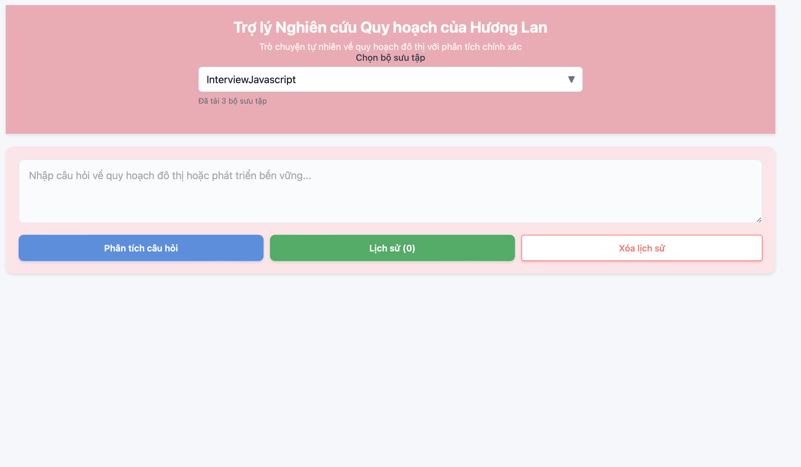
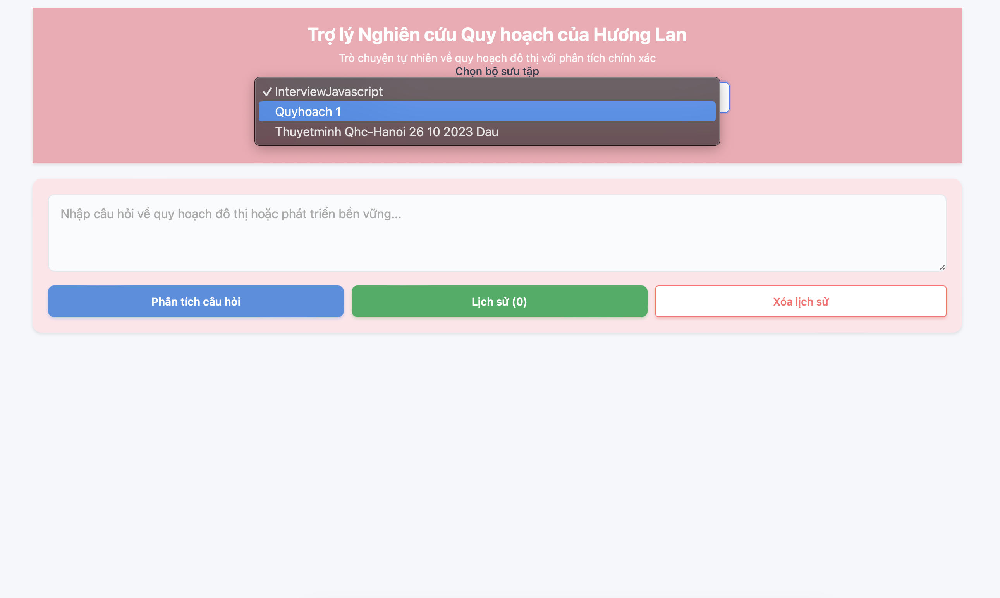
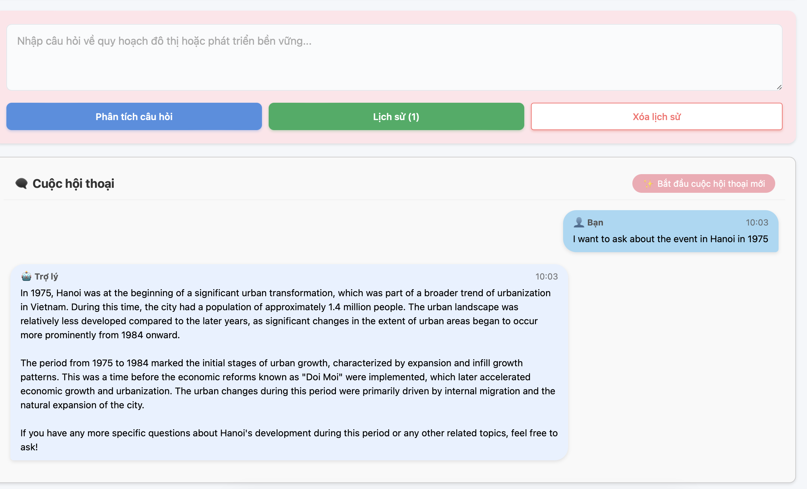
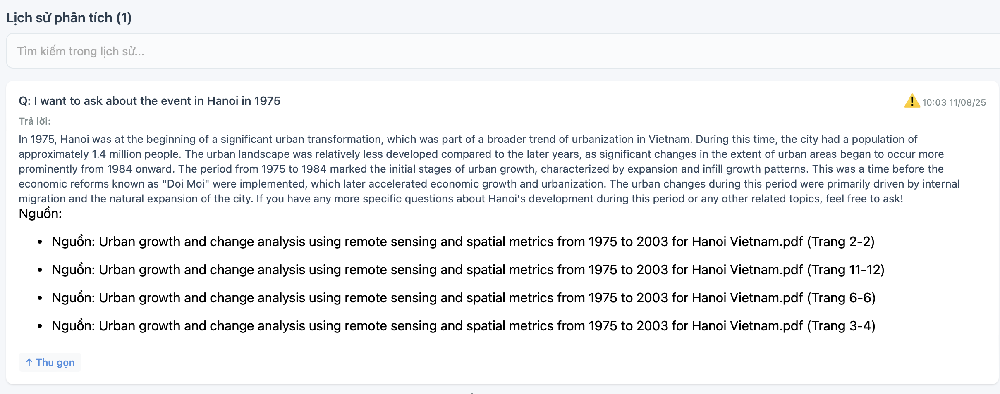
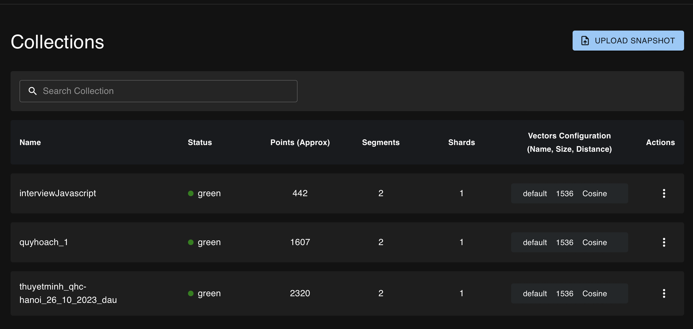
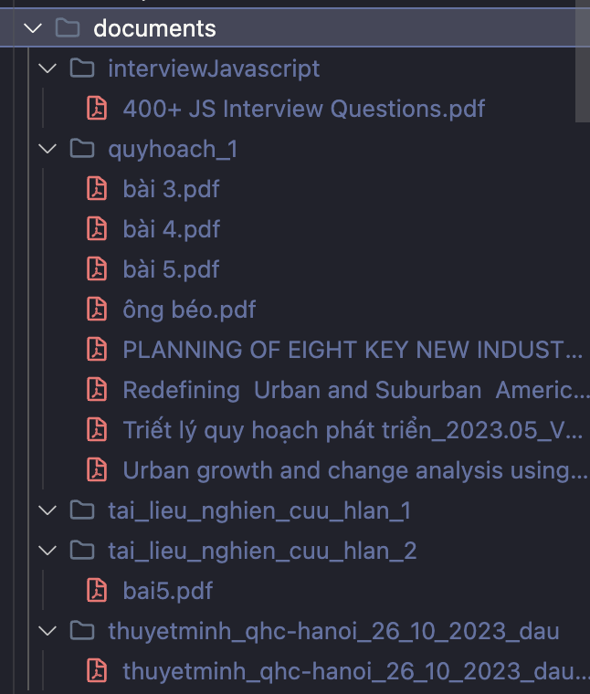

# RAG Assistant By Next.js

An intelligent document query, research, and search support system using RAG (Retrieval-Augmented Generation) technology with embedded document collections.

## 📋 Overview
RAG Assistant is a web application built with Next.js that enables users to:
- Embed and store documents in organized collections
- Query information intelligently from document collections
- Interact with an AI assistant through a chat interface
- Manage and track conversation history
- Incremental document embedding with duplicate detection
  
  
  
  

## 🛠️ Tech Stack
- **Frontend**: Next.js
- **Vector Database**: Qdrant
- **Backend Processing**: Python
- **AI/ML**: Document Embedding & RAG

## 📁 Project Structure
```
RAG-Assistant-By-Nextjs/
├── documents/                 # Root folder for document collections
│   ├── quyhoach_1/           # Example: urban planning documents
│   ├── interviewJavascript/  # Example: JavaScript interview questions
│   ├── thuyetminh_qhc-hanoi_26_10_2023_dau/  # Example: Hanoi planning report
│   └── ...                   # Other document collections
├── tracking/                 # Tracks embedded documents per collection
│   ├── quyhoach_1.json      # List of embedded files for quyhoach_1
│   ├── interviewJavascript.json
│   └── ...
├── embedding.py
├── exports/                 # Tracks embedded documents per collection
│   ├── collections.json                 # Document embedding script
├──           # Exported collections metadata
├── pages/                    # Next.js pages
└── ...
```

## 🚀 Getting Started

### Prerequisites
- Node.js (v16 or higher)
- Python (v3.8 or higher)
- Qdrant Vector Database

### Installation
```bash
# Install Next.js dependencies
yarn install

# Install Python dependencies
pip install -r requirements.txt
```

### Setup Qdrant
Ensure Qdrant server is running and accessible.

## 📚 Usage

### 1. Document Embedding
To embed documents into collections, use the following command:
```bash
python embedding.py <collection_name>
```


<br>
**Example:**
```bash
python embedding.py quyhoach_1
```
This command will:
- Read all documents from the `documents/quyhoach_1/` folder
- Create embeddings for new documents (skips already embedded files)
- Store them in a Qdrant collection named `quyhoach_1`
- Update the tracking file `tracking/quyhoach_1.json` with processed documents

**Note**: The `<collection_name>` should match the subfolder name in the `documents/` directory.

### 2. Export Collections Metadata
After embedding, export the collections information:
```bash
python embedding.py export
```
This generates a `collections.json` file with the following structure:
```json
{
  "exported_at": "2025-07-27T18:26:16.548254",
  "total_collections": 3,
  "collections": [
    "interviewJavascript",
    "quyhoach_1",
    "thuyetminh_qhc-hanoi_26_10_2023_dau"
  ]
}
```
The Next.js application reads this file to display available collections in the UI.

### 3. Running the Web Interface
Start the development server:
```bash
yarn dev
```
The web application will be available at `http://localhost:3000`.

## 🖥️ Web Interface Features

### Collection Selection
- Dropdown/selection interface showing all available collections from `collections.json`
- Each collection represents a specific domain or topic
- Dynamic loading based on exported collections metadata

### Conversational AI Assistant
- Interactive chat interface for asking questions
- Context-aware responses based on the selected document collection
- Real-time query processing and intelligent information retrieval

### Chat History Management
- View previous conversations and queries
- Track interaction history for reference
- Search through past conversations

## 🔧 How It Works

### Document Processing Flow
1. **Document Organization**: Place documents in subfolders within `documents/` directory
2. **Initial Embedding**: Run `python embedding.py <collection_name>` to process documents
3. **Tracking System**: System creates `tracking/<collection_name>.json` to record processed files
4. **Incremental Updates**: When adding new documents, re-run embedding to process only new files
5. **Collection Export**: Run `python embedding.py export` to update `collections.json`
6. **Web Interface**: Next.js reads `collections.json` to populate collection selector

### Incremental Embedding System
The tracking system prevents re-processing of already embedded documents:
- Each collection has a corresponding tracking file in the `tracking/` folder
- Contains list of previously embedded document filenames
- New embedding runs skip files already in the tracking list
- Enables efficient incremental updates when adding new documents

## 📝 Example Workflow
1. **Setup Documents**:
```
documents/
├── quyhoach_1/
│   ├── document1.pdf
│   └── document2.docx
```

2. **Initial Embedding**:
```bash
python embedding.py quyhoach_1
```

3. **Add More Documents**:
```
documents/quyhoach_1/
├── document1.pdf      # Already embedded
├── document2.docx     # Already embedded
└── document3.pdf      # New document
```

4. **Incremental Embedding** (only processes `document3.pdf`):
```bash
python embedding.py quyhoach_1
```

5. **Export Collections**:
```bash
python embedding.py export
```

6. **Start Web App**:
```bash
yarn dev
```

7. **Query Documents**: Select "quyhoach_1" and start asking questions

## 🗂️ File Management

### Tracking Files
- Located in `tracking/` folder
- One JSON file per collection
- Contains list of embedded document filenames
- Automatically updated during embedding process

### Collections Metadata
- `collections.json` contains all available collections
- Updated via `python embedding.py export`
- Used by Next.js frontend to populate collection selector
- Includes timestamp and total collection count

## 🤝 Contributing
Feel free to contribute to this project by:
- Adding new features
- Improving documentation
- Reporting bugs
- Suggesting enhancements

## 📄 License
[Add your license information here]

## 🆘 Support
For questions and support, please create an issue or contact the development team.
